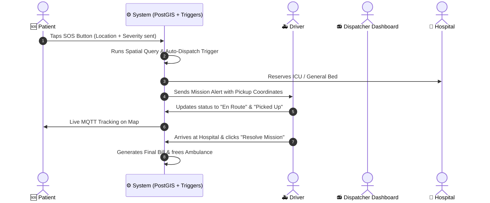

# 🚑 Druto Sheba (দ্রুত সেবা) - Project Concept, Architecture & Feature Guide

---

## 📌 ১. প্রজেক্টের মূল উদ্দেশ্য (Project Overview & Purpose)

**Druto Sheba (দ্রুত সেবা)** হলো একটি **Next-Generation Emergency Response & Fleet Management System** (জরুরি চিকিৎসা সেবা ও অ্যাম্বুলেন্স নেভিগেশন প্ল্যাটফর্ম)।

### 🎯 উদ্দেশ্য (Why it exists):
জরুরি চিকিৎসায় সমন্বয়ের অভাব দূর করতে প্রজেক্টটির মূল লক্ষ্য:
1. **জরুরি সাড়াদানের সময় কমানো**: রোগীর SOS ক্লিক মাত্রই নিকটস্থ গাড়ি ও সেরা হাসপাতালের সমন্বয়।
2. **ডাক্তার ও হাসপাতালের রিসোর্স অপটিমাইজেশন**: রোগের ধরন অনুযায়ী আইসিইউ/বেড বুকিং এবং বিশেষজ্ঞ চিকিৎসকের শিডিউল ম্যাপিং।
3. **লাইভ ট্র্যাকিং ও বিলিং**: স্বচ্ছ ও অটোমেটেড রাইড বিলিং এবং লাইভ ট্র্যাকিং।

---

## 🔑 ২. প্রধান পোর্টাল এবং ফিচারসমূহ (Core Portals & Features in Detail)

### 1. 🆘 Patient Portal (রোগী পোর্টাল - `/sos`, `/track`, `/appointments`, `/my-bills`, `/history`)
* **One-Tap SOS Alert (`/sos`)**: 
  - *প্রযুক্তি*: HTML5 Geolocation API, JavaScript Fetch, PostgreSQL PostGIS `ST_SetSRID`.
  - *বিবরণ*: জিপিএস কোঅর্ডিনেট, রোগীর রক্তের গ্রুপ ও অ্যালার্জি ডেটাবেসে পাঠিয়ে স্বয়ংক্রিয় ট্রিপ নির্ধারণ করে।
* **Live Map Tracking (`/track`)**:
  - *প্রযুক্তি*: Leaflet.js, React-Leaflet, HiveMQ MQTT (WebSocket Client over SSL).
  - *বিবরণ*: অ্যাম্বুলেন্সের জিপিএস টেলিমেট্রি লাইভ ট্র্যাক করে ও রুট Polyline জেনারেট করে।
* **My Appointments (`/appointments`)**:
  - *প্রযুক্তি*: React Hooks, Next.js API, DB Queries.
  - *বিবরণ*: রোগীর বুক করা চিকিৎসকদের তালিকা ও সময়সূচী। যদি এডমিন পেমেন্ট রিকোয়েস্ট পাঠায়, তবে স্ক্রিনে ওয়ার্নিং ব্যানার দেখায়। রোগী চাইলে বুকিং ক্যানসেল করতে পারে। ক্যানসেল করলে পেমেন্ট পরিশোধিত থাকলে স্বয়ংক্রিয়ভাবে `Refunded` এবং অপরিশোধিত থাকলে `N/A` তে কনভার্ট হয়ে যায়।
* **My Invoices (`/my-bills`)**:
  - *প্রযুক্তি*: JavaScript Print API (`window.print()`).
  - *বিবরণ*: ট্রিপ শেষে অ্যাম্বুলেন্স ভাড়ার লাইভ বিল প্রদান। এডমিন রিমাইন্ডার দিলে রোগী ব্যানার দেখে সতর্ক হতে পারে এবং Pay Securely বাটনে পে করতে পারে।
* **Emergency History (`/history`)**:
  - *প্রযুক্তি*: React Modals, Print API.
  - *বিবরণ*: রোগীর আগের সমস্ত ট্রিপ এবং ওএসআরএম ভাড়ার ডিটেইলস সহ পিডিএফ ইনভয়েস প্রিন্ট করার সুবিধা।

### 2. 📻 Dispatcher Dashboard (ডিসপ্যাচার কমান্ড সেন্টার - `/dashboard`)
* **Live Emergency Feed**: 
  - *প্রযুক্তি*: Auto-Refresh Hooks, Next.js Server-Side Actions.
  - *বিবরণ*: লাইভ ইমার্জেন্সি রিকোয়েস্ট মনিটরিং।
* **Automated Dispatch Engine**:
  - *প্রযুক্তি*: PostgreSQL PL/pgSQL Function `fn_automated_dispatch`.
  - *বিবরণ*: রোগীর লোকেশন ও জোন অনুযায়ী অটোমেটিক নিকটস্থ ফাকা অ্যাম্বুলেন্স এবং আইসিইউ বেড খালি থাকা হাসপাতালকে যুক্ত করে ডিউটি রি-অ্যাসাইন করে।

### 3. 🚑 Driver App (ড্রাইভার পোর্টাল - `/duty`, `/driver-history`, `/schedule`)
* **Mission Navigation**:
  - *প্রযুক্তি*: Leaflet.js Map, Routing API.
  - *বিবরণ*: জিপিএস লোকেশনে পৌঁছাতে ড্রাইভারকে ওএসআরএম গাইডেন্স ম্যাপ প্রদান।
* **Status Sync & Release**:
  - *প্রযুক্তি*: SQL Table Transactions.
  - *বিবরণ*: বোতাম চেপে স্ট্যাটাস ট্র্যাকিং (`En Route` ➔ `Picked Up` ➔ `Resolved`)। রিজলভড বাটন প্রেস করলে গাড়ির অবস্থা অটোমেটিক `Available` হয় এবং হাসপাতালের বেড খালি হয়ে যায়।

### 4. 📊 Admin & Analytics (অ্যাডমিন কন্ট্রোল প্যানেল - `/analytics`, `/doctors`, `/billing`, `/control`)
* **Live Fleet & Hospital Stock**: 
  - *প্রযুক্তি*: SQL Aggregations, Recharts (JavaScript graphs).
  - *বিবরণ*: অ্যাম্বুলেন্সের তেল, অক্সিজেন ও বেড স্টকের লাইভ মনিটরিং।
* **Doctors Directory & Dynamic Scheduler (`/doctors`)**:
  - *প্রযুক্তি*: DB `SELECT`, `UPDATE` Queries.
  - *বিবরণ*: ডাক্তারদের তালিকা এবং তাদের লাইভ শিডিউল পরিচালনা। রোগী চিকিৎসকের অ্যাপয়েন্টমেন্ট রিকোয়েস্ট পাঠালে এডমিন তার পেমেন্ট ক্লিয়ারেন্স হওয়া সাপেক্ষে চিকিৎসকের সাপ্তাহিক একাধিক ডিউটি দিনের যেকোনো একটি দিন (Monday/Thursday) সিলেক্ট করে দিলে অটোমেটিক পরবর্তী ক্যালেন্ডার তারিখ হিসেব করে বুকিং কনফার্ম হয়।
* **Billing Audit Console (`/billing`)**:
  - *প্রযুক্তি*: Javascript Search, Print Invoices & Modal View.
  - *বিবরণ*: শহরের সব অ্যাম্বুলেন্স রাইডের বিল কালেকশন। ট্রিপ শেষ হওয়ার পর যদি রোগী বিল না দেয়, তবে এডমিন প্যানেল থেকে ওয়ান-ক্লিক **Send Reminder** ব্যানার নোটিফিকেশন পুশ করতে পারেন।

---

## ⚙️ ৩. ব্যাকএন্ড ও ডেটাবেস সিস্টেম কীভাবে কাজ করে? (Backend & Database Architecture)

এই প্রজেক্টটিতে উচ্চ ক্ষমতার **PostgreSQL Database** এবং **PostGIS (Spatial Intelligence Extension)** ব্যবহার করা হয়েছে।

### 🗄️ ডেটাবেস টেবিল ও স্ট্রাকচার:
1. `emergency_requests`: সমস্ত ইমার্জেন্সি কল ও লোকেশন পয়েন্ট স্টোর করে।
2. `hospitals`: হাসপাতালের লোকেশন coordinates (`GEOMETRY Point`), সাধারণ বেড ও ICU বেড কাউন্ট সংরক্ষণ করে।
3. `ambulances` & `drivers`: গাড়ি ও ড্রাইভারদের অন-ডিউটি স্টেটাস পরিচালনা করে।
4. `trip_logs`: রোগী, হাসপাতাল, ড্রাইভার এবং অ্যাম্বুলেন্সের মধ্যে যুক্ত থাকা লাইভ মিশন রেকর্ড করে।
5. `billing`: ট্রিপ শেষ হলে অটোমেটিক ট্যাক্সসহ রাইড বিল ক্যালকুলেট করে।
6. `doctor_assignments`: রোগীদের জন্য নির্ধারিত চিকিৎসকের অ্যাপয়েন্টমেন্ট ও লাইভ পেমেন্ট স্ট্যাটাস ট্র্যাক করে।

### ⚡ অটোমেটেড ট্র্রিগার (Database Triggers):
* **`fn_automated_dispatch`**: যখনই নতুন রিকোয়েস্ট আসে, এই PL/pgSQL ফাংশনটি স্বয়ংক্রিয়ভাবে নিকটস্থ ফাকা অ্যাম্বুলেন্স এবং খালি বেড থাকা উপযুক্ত হাসপাতালটি বুক করে ট্রিপ চালু করে দেয়।
* **`emergency_analytics_mv`**: পারফরম্যান্স বাড়ানোর জন্য এটি একটি Materialized View যা লাইভ ড্যাশবোর্ডের সমস্ত হিসেব অতি দ্রুত রেন্ডার করে।

---

## 🔄 ৪. সম্পূর্ণ কাজের প্রবাহ (End-to-End Workflow Step-by-Step)

---

## 🛠️ ৫. ব্যবহৃত প্রযুক্তিসমূহ (Technology Stack Summary)

* **Frontend**: Next.js 16 (App Router), React 19, Vanilla CSS.
* **Database**: PostgreSQL with PostGIS extension.
* **Hosting / BaaS**: Supabase.
* **Real-time Map**: Leaflet.js with customized safe unmount patching.
* **Real-time Telemetry**: MQTT (HiveMQ) protocol.
