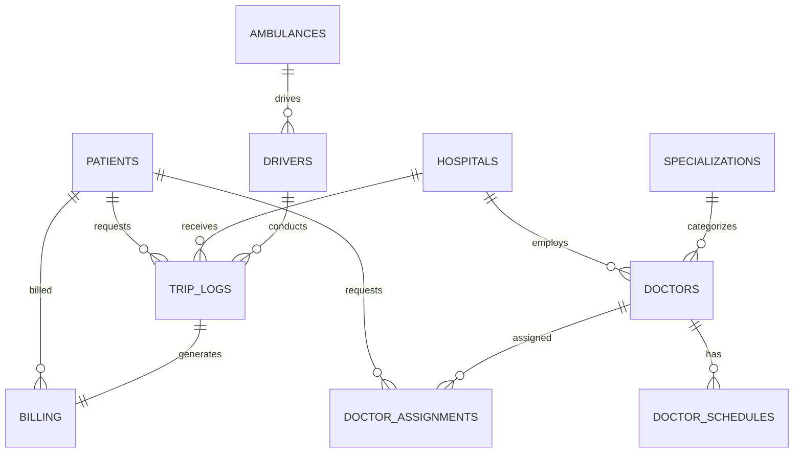

# 🚑 Druto Sheba (দ্রুত সেবা) — Project Proposal & Presentation Master Documentation
> **Target Audience**: Course Faculty / Instructor & Project Evaluation Board  
> **Designed For**: Presentation Slide Generation & Project Proposal Evaluation  
> **System Type**: Next-Generation Emergency Response, PostGIS Spatial Intelligence & Fleet Management System

---

## 👥 প্রজেক্ট টিম মেম্বারস (Project Team Members)

| Student ID | Student Name | Role / Designation |
| :--- | :--- | :--- |
| **112420647** | **Imran-Nur Shawon** | System Architecture & Database Design |
| **112330679** | **Afrin Fatema** | UI/UX & Frontend Integration |
| **112420035** | **Moheuddin Sikder Saikat** | PostGIS Intelligence & Backend Logic |
| **112330575** | **Md.Rubyat Simum Mahi** | Telemetry, Routing & Data Analysis |

---

## 📋 সূচিপত্র (Table of Contents)
1. 🎯 [প্রজেক্ট ওভারভিউ ও প্রয়োজনীয়তা (Executive Overview & Need)](#1-প্রজেক্ট-ওভারভিউ-ও-প্রয়োজনীয়তা-executive-overview--need)
2. 🌟 [প্রধান মডিউল ও সিস্টেম ফিচারসমূহ (Core Portals & Features)](#2-প্রধান-মডিউল-ও-সিস্টেম-ফিচারসমূহ-core-portals--features)
3. 🗺️ [ম্যাপভিত্তিক ট্র্যাকিং ও নেভিগেশন ইমপ্লিমেন্টেশন (Map-Based Implementation Architecture)](#3-ম্যাপভিত্তিক-ট্র্যাকিং-ও-নেভিগেশন-ইমপ্লিমেন্টেশন-map-based-implementation-architecture)
4. 🗄️ [সম্পূর্ণ ডেটাবেস স্কিমা ও টেবিল ডিরেক্টরি (All Tables Detailed Directory)](#4-সম্পূর্ণ-ডেটাবেস-স্কিমা-ও-টেবিল-ডিরেক্টরি-all-tables-detailed-directory)
5. 🔗 [টেবিলসমূহের আন্তঃসম্পর্ক ও রিলেশনশিপ (ER Model & Foreign Key Mapping)](#5-টেবিলসমূহের-আন্তঃসম্পর্ক-ও-রিলেশনশিপ-er-model--foreign-key-mapping)
6. ⚡ [অটোমেটেড ট্র্রিগার, PL/pgSQL ফাংশন ও ভিউ (Triggers, Functions & Views)](#6-অটোমেটেড-ট্র্রিগার-plpgsql-ফাংশন-ও-ভিউ-triggers-functions--views)
7. 🌐 [PostGIS স্পেশিয়াল ইন্টেলিজেন্স ও লোকেশন সিস্টেম (Spatial Intelligence System)](#7-postgis-স্পেশিয়াল-ইন্টেলিজেন্স-ও-লোকেশন-সিস্টেম-spatial-intelligence-system)
8. 📊 [প্রেজেন্টেশন ও ভাইভার জন্য ৫টি মূল SQL কোয়েরি (Core Presentation Queries)](#8-প্রেজেন্টেশন-ও-ভাইভার-জন্য-৫টি-মূল-sql-কোয়েরি-core-presentation-queries)

---

## 1. 🎯 প্রজেক্ট ওভারভিউ ও প্রয়োজনীয়তা (Executive Overview & Need)

### ❓ কেন এই প্রজেক্টটি প্রয়োজন? (Problem Statement)
জরুরি চিকিৎসা সেবায় সময় ও তথ্য অপচয় রোধ করতে একটি সমন্বিত প্রযুক্তির প্রয়োজনীয়তা রয়েছে:
1. **স্বয়ংক্রিয় ডিসপ্যাচের অভাব**: ম্যানুয়ালি অ্যাম্বুলেন্স খোঁজা ও হাসপাতালে বেড ফাঁকা আছে কিনা তা জানতে অনেক সময় অপচয় হয়।
2. **রিসোর্সের সঠিক ম্যাপিং না থাকা**: রোগীর কার্ডিয়াক বা অন্য কোনো ক্রcritical কন্ডিশনে হাসপাতালে নির্দিষ্ট বিশেষজ্ঞ চিকিৎসকের ডিউটি শিডিউল এবং লাইভ ওয়ান-ক্লিক বুকিং গুরুত্বপূর্ণ ভূমিকা পালন করে।
3. **লাইভ ট্র্যাকিং ও ইনস্ট্যান্ট রিফান্ড ট্র্যাকিং**: জরুরি অবস্থায় স্বচ্ছ লাইভ ট্র্যাকিং এবং তাৎক্ষণিক ওয়ান-ট্যাপ ক্যানসেলেশন ও রিফান্ড ম্যানেজমেন্টের অভাব।

---

## 2. 🌟 প্রধান মডিউল ও সিস্টেম ফিচারসমূহ (Core Portals & Features)

### 1. 🆘 Patient Portal (`/sos`, `/track`, `/appointments`, `/my-bills`, `/history`)
* **One-Tap SOS Alert**: বাটন চাপামাত্রই ব্রাউজারের GPS / IP থেকে অক্ষাংশ ও দ্রাঘিমাংশ (Lat/Lon) এবং রোগীর কন্ডিশন সার্ভারে চলে যায়।
* **Live Map Tracking**: Leaflet.js এবং MQTT দিয়ে অ্যাম্বুলেন্সের প্রতি সেকেন্ডের লোকেশন দৃশ্যমান হয়।
* **Doctor Booking & Payment**: রোগী বিশেষজ্ঞ ডাক্তারের রিকোয়েস্ট পাঠাতে পারে। এডমিন পেমেন্ট রিকোয়েস্ট পাঠালে Pay Securely ক্লিক করে বিল পরিশোধ করা যায়। পরিশোধের পর ক্যানসেল করলে *"You got your refund"* বার্তা শো করে এবং স্ট্যাটাস `Refunded` হয়ে যায়। পেমেন্ট না করে ক্যানসেল করলে স্ট্যাটাস `N/A` হয়ে যায় এবং পেমেন্ট বাটন হাইড হয়ে যায়।

### 2. 📻 Dispatcher Dashboard (`/dashboard`)
* **Live Emergency Feed**: শহরের সমস্ত সক্রিয় ইমার্জেন্সি কলের লাইভ তালিকা।
* **Auto-Dispatch Algorithm**: ডাটাবেস ফাংশন নিজে থেকেই রোগী ➔ অ্যাম্বুলেন্স ➔ হাসপাতালের ত্রিভুজাকৃতি যোগসূত্র তৈরি করে বুকিং কনফার্ম করে।

### 3. 🗺️ Driver App (`/duty`, `/schedule`)
* **Mission Alert & Navigation**: ড্রাইভারের স্ক্রিনে রোগীর লোকেশন, রোগের ভয়াবহতা (Severity Level) এবং ওএসআরএম রুট ম্যাপ শো করে।
* **Status Synchronizer**: ড্রাইভার তার কাজের অগ্রগতির সাথে সাথে বোতাম চেপে স্টেটাস আপডেট করেন: `On Duty` ➔ `En Route` ➔ `Picked Up` ➔ `Arrived` ➔ `Resolved`.

### 4. 📊 Admin & Analytics (`/analytics`, `/doctors`, `/billing`)
* **Hospital Capacity Tracking**: ঢাকার প্রধান হাসপাতালের ICU ও General বেডের লাইভ মনিটরিং।
* **Doctors Directory & Day Scheduler**: ডাক্তারদের বুকিং ও শিডিউল ম্যানেজমেন্ট। রোগী রিকোয়েস্ট পাঠালে এডমিন তার পেমেন্ট পরিশোধ সাপেক্ষে চিকিৎসকের সাপ্তাহিক দিন (যেমন: Monday/Thursday) সিলেক্ট করে দিলে সিস্টেম পরবর্তী ক্যালেন্ডার তারিখ হিসেব করে বুকিং কনফার্ম করে।
* **Billing Console**: শহরের সব অ্যাম্বুলেন্স ট্রিপ বিল মনিটরিং এবং ওয়ান-ক্লিক **Send Reminder** অপশন।

---

## 3. 🗺️ ম্যাপভিত্তিক ট্র্যাকিং ও নেভিগেশন ইমপ্লিমেন্টেশন (Map-Based Implementation Architecture)

### 🛠️ ১. ফ্রন্টএন্ড ম্যাপ রেন্ডারিং (Frontend Map Rendering Library)
* **লাইব্রেরি**: `Leaflet.js` এবং এর রিয়্যাক্ট বাইন্ডিং `react-leaflet`।
* **ম্যাপ টাইলস**: CartoDB Voyager / Voyager Dark।
* **আনমাউন্টিং প্যাচ**: Next.js নেভিগেশনের সময় ম্যাপ আনমাউন্ট করার সময় জুম অ্যানিমেশনগুলো চলতে থাকলে Leaflet-এর DOM কনটেইনারের সাথে কনফ্লিক্ট হতো। আমরা `L.Map.prototype._onZoomTransitionEnd` ফাংশনটিকে ইন্টারসেপ্ট করে মাউন্টিং কন্ডিশনাল রিকোয়েস্ট চেক ও ট্রাই-ক্যাচ দিয়ে প্যাচ করেছি।

### 🛣️ ২. রুট নেভিগেশন ও ডাইনামিক রাস্তা আঁকা (Routing Engine)
* **প্রযুক্তি**: **OSRM (Open Source Routing Machine) API**।
* OSRM API ও Coordinate Polyline ডাইনামিকালি ম্যাপে রেন্ডার করা হয়।

### 🛰️ ৩. লাইভ জিও-লোকেশন ও টেলিমেট্রি (Real-Time GPS Telemetry)
* **প্রটোকল**: **MQTT (Message Queuing Telemetry Transport)** ওভার **HiveMQ Broker**।

---

## 4. 🗄️ সম্পূর্ণ ডেটাবেস স্কিমা ও টেবিল ডিরেক্টরি (All Tables Detailed Directory)

### 🅰️ এনাম টাইপস
1. `equipment_lvl`: `'Basic'`, `'Advanced'`, `'Basic Life Support'`, `'Advanced Life Support'`, `'ICU Support'`
2. `hospital_type`: `'Government'`, `'Private'`
3. `req_status`: `'Pending'`, `'Active'`, `'En Route'`, `'Picked Up'`, `'Arrived'`, `'Resolved'`, `'Cancelled'`, `'Broadcast'`, `'Admitted'`
4. `severity_lvl`: `'Low'`, `'Medium'`, `'High'`, `'Critical'`
5. `shift_status`: `'On_Duty'`, `'Off_Duty'`, `'Available'`, `'Dispatched'`, `'On_Trip'`, `'Offline'`
6. `vehicle_status`: `'Available'`, `'Dispatched'`, `'Maintenance'`, `'Offline'`
7. `assignment_status`: `'Pending'`, `'Confirmed'`, `'Completed'`, `'Cancelled'`

---

### 🅱️ কোর টেবিলসমূহ
* `hospitals`: শহরের হাসপাতালের জিপিএস কোঅর্ডিনেট, নাম ও বেড কাউন্ট সংরক্ষণ করে।
* `patients`: রোগীদের ব্যক্তিগত ও জরুরি কন্টাক্ট ইনফরমেশন সংরক্ষণ করে।
* `ambulances`: লাইসেন্স প্লেট ও বর্তমান লাইভ স্ট্যাটাস ধারণ করে।
* `drivers`: অন-ডিউটি বা অফ-ডিউটি অবস্থা ট্র্যাকিং।
* `trip_logs`: প্রতি ট্রিপের সময়, ভাড়া ও গন্তব্য ট্র্যাকিং করে।
* `billing`: অটোমেটিক ট্যাক্সসহ রাইড বিল ক্যালকুলেট করে।
* `specializations`: বিভিন্ন বিশেষায়িত চিকিৎসা বিভাগ।
* `doctors`: ডাক্তারদের তালিকা ও অ্যাভেইল্যাবিলিটি।
* `doctor_schedules`: ডাক্তারদের সাপ্তাহিক সময়সূচী।
* `doctor_assignments`: রোগীদের জন্য নির্ধারিত চিকিৎসকের অ্যাপয়েন্টমেন্ট ও লাইভ পেমেন্ট স্ট্যাটাস।

---

## 5. 🔗 ER Model & Relationships


---

## 6. ⚡ অটোমেটেড ট্র্রিগার, PL/pgSQL ফাংশন ও ভিউ
* **`fn_automated_dispatch`**: রোগীর কন্ডিশন ও দূরত্বের ওপর ভিত্তি করে অটোমেটিক নিকটতম অ্যাম্বুলেন্স এবং সেরা হাসপাতাল অ্যাসাইন করে।
* **`emergency_analytics_mv`**: মেটেরিয়ালাইজড ভিউ ড্যাশবোর্ডের সমস্ত হিসেব অতি দ্রুত রেন্ডার করে।

---

## 7. 🌐 PostGIS স্পেশিয়াল ইন্টেলিজেন্স ও লোকেশন সিস্টেম
* PostGIS `geometry(Point,4326)` এর মাধ্যমে দুই স্থানের প্রকৃত ভৌগলিক দূরত্ব মিটার/কিলোমিটারে তাৎক্ষণিক বের করা যায়।

---

## 8. 📊 প্রেজেন্টেশন ও ভাইভার জন্য ৫টি মূল SQL কোয়েরি

### Query 1: Full Doctor Appointment Details (৫টি টেবিল JOIN)
```sql
SELECT 
    da.assignment_id,
    p.name AS patient_name,
    d.name AS doctor_name,
    h.name AS hospital_name,
    s.spec_name,
    da.appointment_date,
    da.payment_status
FROM doctor_assignments da
JOIN patients p ON da.patient_id = p.patient_id
JOIN doctors d ON da.doctor_id = d.doctor_id
LEFT JOIN hospitals h ON d.hospital_id = h.hospital_id
LEFT JOIN specializations s ON d.spec_id = s.spec_id
ORDER BY da.assignment_id DESC;
```
> **ব্যাখ্যা**: অ্যাপয়েন্টমেন্ট ডিটেইলস এবং পেমেন্ট রিমাইন্ডার ট্র্যাকিং রিপোর্ট।
