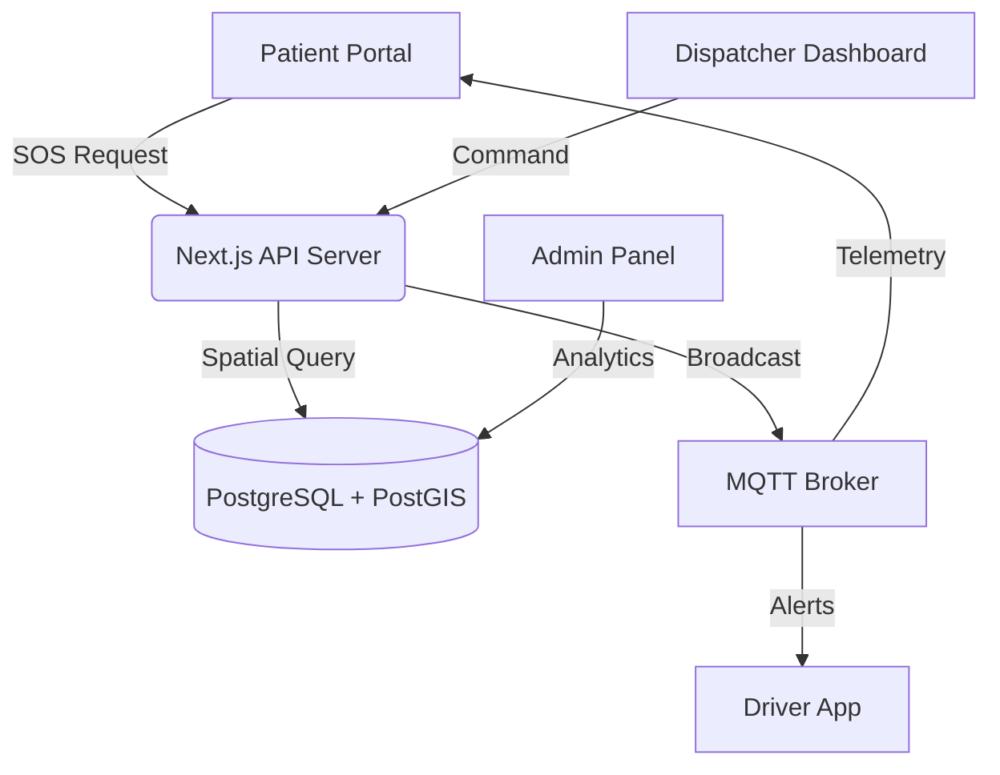

# 🏥 PROJECT REPORT: Druto Sheba (দ্রুত সেবা)
## Advanced Emergency Response Management System

**Prepared for**: UIU CSE DBMS Project Showcase (2026)  
**Status**: Production Ready / V2.0  
**Developer**: Naiimur Rahman  

---

## 1. Executive Summary
**Druto Sheba** is a mission-critical platform designed to bridge the gap between patients, emergency dispatchers, and hospitals in Dhaka. By leveraging real-time spatial intelligence (PostGIS) and automated resource allocation algorithms, the system reduces life-saving seconds during critical emergencies.


*Figure 1: The Dispatcher Command Center with real-time incident tracking and fleet status.*

---

## 2. Problem Statement
In high-density urban environments like Dhaka, emergency response is often delayed due to:
*   Lack of real-time visibility into ambulance locations.
*   Inefficient hospital matching (patients sent to hospitals without specialized departments).
*   Manual, error-prone dispatch processes.

**Druto Sheba** solves these issues through **Automated Specialization-Aware Dispatching**.

---

## 3. System Architecture



---

## 4. Key Innovation: The Dispatch Algorithm
The system utilizes a custom PL/pgSQL engine that evaluates multiple factors in milliseconds:
1.  **Spatial Proximity**: Finds the nearest available unit.
2.  **Specialization Match**: Heart Attack → Cardiology; Accident → Trauma Surgery.
3.  **Capacity Check**: Only dispatches to hospitals with available ICU/General beds.

### Code Highlight: SQL Specialized Logic
```sql
-- Excerpt from fn_automated_dispatch
SELECT h.Hospital_ID, h.Name INTO v_Hospital, v_Hospital_Name FROM Hospitals h
LEFT JOIN Hospital_Specializations hs ON h.Hospital_ID = hs.Hospital_ID
LEFT JOIN Specializations s ON hs.Spec_ID = s.Spec_ID
WHERE 
    ((v_Severity IN ('High', 'Critical') AND h.ICU_Beds > 0) 
    OR (v_Severity IN ('Low', 'Medium') AND h.General_Beds > 0))
ORDER BY 
    (s.Spec_Name = v_Specialization) DESC,
    ST_Distance(h.Location_Coords::geography, v_Patient_Coords::geography) ASC
LIMIT 1;
```

---

## 5. Visual Portal Overviews

### 🆘 Patient SOS & Tracking
Designed for high-stress situations with a minimal, high-contrast interface.


*Figure 2: Mobile SOS interface with live GPS ambulance tracking.*

### 📊 Real-time Analytics
Provides administrators with deep insights into system performance and resource health.


*Figure 3: Analytics dashboard showing volume trends, bed availability, and fleet health indicators.*

---

## 6. Implementation Achievements
*   **Mega-Seeding**: Successfully implemented a generator that populates **5,000+ realistic records** for comprehensive performance testing.
*   **Timezone Localization**: Full system synchronization to **Asia/Dhaka (GMT+6)**.
*   **Predictive Maintenance**: Automated flagging of vehicles requiring repair based on mission history.
*   **Billing Engine**: Instant PDF-ready bill generation with distance-based pricing.

---

## 7. Future Roadmap
*   **AI Route Optimization**: Integration with Google Maps Traffic API for even faster arrivals.
*   **IoT Integration**: Real-time oxygen level monitoring inside ambulances via MQTT sensors.
*   **Multi-City Support**: Expanding the zone boundary logic beyond Dhaka Metro.

---
**Prepared by**: Naiimur Rahman  
**Date**: May 10, 2026  
**DHAKA METRO • SYSTEM V2.0**
