# 🎬 Druto Sheba: Project Demo Video Script

**Target Length:** ~12-15 Minutes  
**Language:** Bangla (with technical terms in English)  
**Tone:** Professional, Confident, and Explanatory

---

## 1. Project Overview (1.5 Minutes)

**[Screen: Show the Landing Page or Home Screen of your project]**

**Speaker:** 
"আসসালামু আলাইকুম। আমাদের প্রজেক্টের নাম **Druto Sheba - Emergency Response System**।

আমাদের দেশে emergency medical situation-এ সময়মতো ambulance বা specialist doctor খুঁজে পাওয়া একটা বড় challenge। ঠিক সময়ে response না পাওয়ার কারণে অনেক জীবন হুমকির মুখে পড়ে। এই problem-টি effectively solve করার জন্যই আমরা Druto Sheba system-টি develop করেছি।

এটি একটি real-time, location-based platform। এখানে একজন **Patient** emergency SOS-এর মাধ্যমে instant ambulance call করতে পারবেন, ambulance-এর live location map-এ track করতে পারবেন এবং নির্দিষ্ট hospital-এর specialist doctor-দের সাথে appointment book করতে পারবেন।

আমাদের system-এ total ৩টি main portal আছে:
1. **Patient Portal**: যেখান থেকে service request করা হয়।
2. **Dispatcher/Admin Portal**: যেখান থেকে hospital authority বা admin সব emergency request control করে এবং ambulance assign করে।
3. **Driver Portal**: যেখান থেকে ambulance driver তাদের trip manage করে এবং live location share করে।

চলুন এবার আমাদের system-এর internal database architecture-টি দেখে নিই।"

---

## 2. Database Design & Normalization (4 Minutes)

**[Screen: Show the ER Diagram]**

```mermaid
erDiagram
    Patients {
        SERIAL Patient_ID PK
        VARCHAR Name "NOT NULL"
        VARCHAR Phone "NOT NULL"
        VARCHAR Blood_Type
    }

    Patient_Conditions {
        SERIAL Record_ID PK
        INT Patient_ID FK "NOT NULL"
        VARCHAR Condition_Name "NOT NULL"
    }

    Patient_Emergency_Contacts {
        SERIAL Contact_ID PK
        INT Patient_ID FK "NOT NULL"
        VARCHAR Contact_Name "NOT NULL"
        VARCHAR Relationship "NOT NULL"
        VARCHAR Phone "NOT NULL"
    }

    Hospitals {
        SERIAL Hospital_ID PK
        VARCHAR Name "NOT NULL"
        GEOMETRY Location_Coords "Point 4326"
        INT General_Beds "DEFAULT 0"
        INT ICU_Beds "DEFAULT 0"
        hospital_type Type "DEFAULT Private"
    }

    Specializations {
        SERIAL Spec_ID PK
        VARCHAR Spec_Name "UNIQUE NOT NULL"
        TEXT Description
    }

    Hospital_Specializations {
        INT Hospital_ID PK_FK
        INT Spec_ID PK_FK
        INT Specialist_Count "DEFAULT 0"
    }

    Ambulances {
        SERIAL Vehicle_ID PK
        VARCHAR License_Plate "UNIQUE NOT NULL"
        equipment_lvl Equipment_Level "NOT NULL"
        vehicle_status Current_Status "DEFAULT Available"
    }

    Vehicle_Inventory {
        SERIAL Inventory_ID PK
        INT Vehicle_ID FK "NOT NULL"
        VARCHAR Item_Name "NOT NULL"
        INT Quantity "CHECK >= 0"
        DATE Expiry_Date
    }

    Drivers {
        SERIAL Driver_ID PK
        VARCHAR Name "NOT NULL"
        VARCHAR License_No "UNIQUE NOT NULL"
        shift_status Shift_Status "DEFAULT Off_Duty"
    }

    Emergency_Types {
        SERIAL Type_ID PK
        VARCHAR Type_Name "UNIQUE NOT NULL"
        TEXT Description
        severity_lvl Default_Severity
    }

    Emergency_Requests {
        SERIAL Request_ID PK
        INT Patient_ID FK "NOT NULL"
        GEOMETRY Pickup_Coords "Point 4326"
        severity_lvl Severity_Level "NOT NULL"
        req_status Status "DEFAULT Pending"
    }

    Trip_Logs {
        SERIAL Trip_ID PK
        INT Request_ID FK "UNIQUE NOT NULL"
        INT Vehicle_ID FK "NOT NULL"
        INT Driver_ID FK "NOT NULL"
        INT Hospital_ID FK "NOT NULL"
    }

    Billing {
        SERIAL Bill_ID PK
        INT Trip_ID FK "NOT NULL"
        INT Patient_ID FK "NOT NULL"
        DECIMAL Amount "NOT NULL"
    }

    Doctors {
        SERIAL Doctor_ID PK
        VARCHAR Name "NOT NULL"
        VARCHAR Phone "NOT NULL"
        INT Hospital_ID FK "NOT NULL"
        INT Spec_ID FK "NOT NULL"
        BOOLEAN Is_Available "DEFAULT TRUE"
    }

    %% Relationships
    Patients ||--o{ Patient_Conditions : "has medical"
    Patients ||--o{ Emergency_Requests : "raises"
    Hospitals ||--o{ Hospital_Specializations : "offers"
    Specializations ||--o{ Hospital_Specializations : "available at"
    Ambulances ||--o{ Vehicle_Inventory : "carries"
    Emergency_Requests ||--|| Trip_Logs : "fulfilled by"
    Hospitals ||--o{ Doctors : "has"
    Specializations ||--o{ Doctors : "specialty of"
```



**Speaker:** 
"এটি হচ্ছে আমাদের প্রজেক্টের Entity Relationship বা **ER Diagram**। আমাদের full system-টি চালানোর জন্য আমরা total **২৭টি tables** design করেছি (টাইমিং ফিল্ডগুলো ডায়াগ্রাম থেকে বাদ দেওয়া হয়েছে)।

এখানে main entity গুলো হচ্ছে `Patients`, `Hospitals`, `Ambulances`, `Drivers`, `Doctors`, `Emergency_Requests` এবং `Trip_Logs`। 

**[Screen: Show the Relational Schema]**
- **Patients** (**Patient_ID**, Name, Phone, Blood_Type)
- **Patient_Conditions** (**Record_ID**, *Patient_ID*, Condition_Name)
- **Hospitals** (**Hospital_ID**, Name, Location_Coords, General_Beds, ICU_Beds, Type)
- **Emergency_Requests** (**Request_ID**, *Patient_ID*, Pickup_Coords, Severity_Level, Status)
- **Trip_Logs** (**Trip_ID**, *Request_ID*, *Vehicle_ID*, *Driver_ID*, *Hospital_ID*)
*(এবং অন্যান্য টেবিলসমূহ)*

**Speaker:**
ডেটাবেস স্কিমাটিকে এমনভাবে ডিজাইন করা হয়েছে যেন ডেটা রিডানডেন্সি (redundancy) বা পুনরাবৃত্তি কমানো যায় এবং ডেটার সঠিকতা (data integrity) নিশ্চিত করা যায়। এখন আমি Normalization process নিয়ে কথা বলবো:

1. **First Normal Form (1NF):** প্রতিটি কলামে অ্যাটমিক বা অবিভাজ্য ভ্যালু থাকতে হবে। যেমন `Patients` টেবিলে একই কলামে একাধিক রোগের অবস্থা না রেখে আমরা আলাদা টেবিল তৈরি করেছি: `Patient_Conditions`।
2. **Second Normal Form (2NF):** সমস্ত নন-কি (non-key) অ্যাট্রিবিউট সম্পূর্ণ প্রাইমারি কি-এর উপর নির্ভরশীল হতে হবে। যেমন `Hospital_Specializations` জংশন টেবিলে প্রাইমারি কি হলো কম্পোজিট (`Hospital_ID`, `Spec_ID`), তাই `Specialist_Count` উভয়ের উপরই নির্ভরশীল।
3. **Third Normal Form (3NF):** কোনো ট্রানজিটিভ ডিপেনডেন্সি থাকা যাবে না। যেমন `Trip_Logs` টেবিলে আমরা সরাসরি ড্রাইভারের নাম রাখিনি, শুধু `Driver_ID` রেখেছি। এতে ডেটা ডুপ্লিকেট হয় না এবং 3NF কঠোরভাবে মেনে চলা হয়।

এছাড়াও ডেটাবেসের Data Integrity ১০০% নিশ্চিত করার জন্য আমরা কিছু Custom **ENUM Types** তৈরি করেছি (যেমন `vehicle_status`, `severity_lvl`)।"

---

## 3. SQL Query Demonstrations (4 Minutes)

**[Screen: Open your SQL terminal, PgAdmin, or Supabase SQL Editor]**

**Speaker:** 
"এবার আমি আমাদের database থেকে কিছু important SQL query execute করে দেখাবো।

**Query 1: JOIN (সম্পূর্ণ ইমার্জেন্সি ট্রিপের বিবরণ বের করা)**
প্রথম query-টি দিয়ে আমরা দেখতে চাই কোন patient-এর জন্য কোন হাসপাতাল থেকে কোন ambulance assign করা হয়েছে এবং ড্রাইভার কে।"

**[Action: Execute Query 1 (`01_join_query.sql`)]**
```sql
SELECT 
    er.request_id,
    p.name AS patient_name,
    h.name AS assigned_hospital,
    a.license_plate AS ambulance,
    d.name AS driver_name
FROM trip_logs tl
JOIN emergency_requests er ON tl.trip_id::text = er.request_id::text
JOIN patients p ON er.patient_id = p.patient_id
JOIN hospitals h ON tl.hospital_id = h.hospital_id
JOIN ambulances a ON tl.vehicle_id = a.vehicle_id
JOIN drivers d ON tl.driver_id = d.driver_id;
```

**Speaker:** 
"Result-এ দেখতে পাচ্ছেন JOIN-এর মাধ্যমে আমরা relational data গুলো একসাথে নিয়ে এসেছি।

**Query 2: Aggregation & Grouping (তীব্রতা অনুযায়ী ইমার্জেন্সি রিকোয়েস্ট)**
দ্বিতীয় query-তে আমরা Aggregation function use করে ইমার্জেন্সির তীব্রতা বা লেভেল অনুযায়ী মোট রিকোয়েস্টের সংখ্যা গণনা করবো।"

**[Action: Execute Query 2 (`02_aggregation_query.sql`)]**
```sql
SELECT 
    severity_level, 
    COUNT(request_id) AS request_count
FROM emergency_requests
GROUP BY severity_level
ORDER BY request_count DESC;
```

**Speaker:** 
"এখানে `COUNT` এবং `GROUP BY` use করে আমরা data summarize করেছি।

**Query 3: Subqueries (একাধিক ক্রিটিকাল ইমার্জেন্সি থাকা রোগীদের খুঁজে বের করা)**
এখন আসি Subquery-তে। এই query-র মাধ্যমে আমরা সেইসব patient-দের খুঁজে বের করবো যাদের একাধিক 'Critical' emergency request ছিল।"

**[Action: Execute Query 3 (`03_subquery_query.sql`)]**
```sql
SELECT name, phone 
FROM patients
WHERE patient_id IN (
    SELECT patient_id 
    FROM emergency_requests 
    WHERE severity_level = 'Critical' 
    GROUP BY patient_id 
    HAVING COUNT(request_id) > 1
);
```

**Speaker:** 
"এখানে Main query-র ভেতরে একটি subquery এবং `HAVING` কন্ডিশন use করা হয়েছে। 

**Query 4: Complex Aggregation (রিসোর্স অ্যাভেইলেবিলিটি)**
সবশেষে আমরা অ্যাম্বুলেন্স ও ডাক্তারদের স্ট্যাটাস অনুযায়ী মোট অ্যাভেইলেবল রিসোর্স গণনা করবো।"

```sql
SELECT 
    'Ambulances' as resource_type,
    current_status::text as status_or_type, 
    COUNT(vehicle_id) as available_count
FROM ambulances
GROUP BY current_status
UNION ALL
SELECT 
    'Doctors' as resource_type,
    CASE WHEN is_available THEN 'Available' ELSE 'Busy' END as status_or_type,
    COUNT(doctor_id) as available_count
FROM doctors
GROUP BY is_available;
```

**Speaker:** 
"শুধু সাধারণ query নয়, আমরা database-এ **Advanced Features**-ও implement করেছি যেমন Views, Triggers, এবং PostGIS Extension।"

---

## 4. Core Functionalities Demonstration (3.5 Minutes)

**[Screen: Go to Patient Portal UI]**

**Speaker:** 
"এবার আমি আমাদের system-এর main workflow-টা frontend UI থেকে practically run করে দেখাবো।

প্রথমেই এটা আমাদের **Patient Portal**। একজন patient login করার পর dashboard-এ একটা SOS button দেখতে পারবে। (Click SOS)
Patient যখন SOS trigger করবে, তার phone-এর GPS থেকে live coordinates database-এ পাঠানো হয়।

এছাড়া patient এখানে Doctor-ও book করতে পারবে। (Navigate to 'Book Doctor' page)
এখানে hospital এবং specialization select করলে database থেকে available doctor-দের list চলে আসবে। System-এ validation করা আছে যে একজন patient-এর একটাই active appointment থাকতে পারবে।

**[Screen: Switch to Dispatcher Portal]**

Patient যখন SOS request করে, সাথে সাথে এটা **Dispatcher Portal**-এর live dashboard-এ চলে আসে।
(Show Dispatcher Portal Map). 
Dispatcher map-এর মধ্যে real-time সব patient-এর pickup location এবং available ambulance-এর location দেখতে পান। Dispatcher এখান থেকে closest ambulance-কে select করে assign করলে, request-টি automatically driver-এর কাছে চলে যায়।

**[Screen: Switch to Admin Portal]**

এরপর আমাদের একটা secure **Admin Portal** আছে যেখান থেকে system-এর পুরো operations manage করা হয়। (Navigate through Admin Dashboard).
এখানে admin চাইলে Patients, Ambulances, Hospitals এবং total Billing-এর statistics দেখতে পারে।

**[Screen: Switch to Driver Portal]**

এটি **Driver Portal**। Driver তার dashboard-এ trip request দেখতে পারবে। Trip start করলে, background থেকে continuously driver-এর location patient-কে পাঠানো হতে থাকে, যা patient map-এ দেখতে পারে।
Trip শেষ হলে automatically bill generate হয়ে যায় এবং database trigger-এর মাধ্যমে সেই ambulance-টি next trip-এর জন্য available হয়ে যায়।

সবগুলো user interface খুবই modern, component-based এবং dark-mode supported design-এ করা হয়েছে যাতে night-time-এও user-friendly হয়।"

---

## Conclusion (30 Seconds)

**Speaker:**
"To sum up, Druto Sheba হচ্ছে একটা complete, fully-normalized relational database back-end এবং modern interactive UI-এর একটা proper implementation যা real-world emergency response problems effectively handle করতে সক্ষম।

Thank you for your time and for watching the demonstration of our project."
