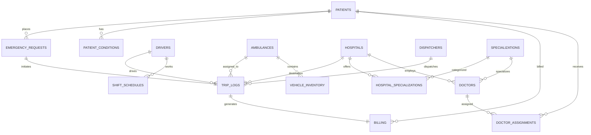

# 🚑 Druto Sheba (দ্রুত সেবা) — Complete Master System & DBMS Documentation
> **Target Audience**: Course Faculty / Instructor & Project Teammates  
> **System Type**: Next-Generation Emergency Response, PostGIS Spatial Intelligence & Fleet Management System

---

## 📋 সূচিপত্র (Table of Contents)
1. 🎯 [প্রজেক্ট ওভারভিউ ও প্রয়োজনীয়তা (Executive Overview & Need)](#1-প্রজেক্ট-ওভারভিউ-ও-প্রয়োজনীয়তা-executive-overview--need)
2. 🌟 [প্রধান মডিউল ও সিস্টেম ফিচারসমূহ (Core Portals & Features)](#2-প্রধান-মডিউল-ও-সিস্টেম-ফিচারসমূহ-core-portals--features)
3. 🗄️ [সম্পূর্ণ ডেটাবেস স্কিমা ও টেবিল ডিরেক্টরি (All Tables Detailed Directory)](#3-সম্পূর্ণ-ডেটাবেস-স্কিমা-ও-টেবিল-ডিরেক্টরি-all-tables-detailed-directory)
4. 🔗 [টেবিলসমূহের আন্তঃসম্পর্ক ও রিলেশনশিপ (ER Model & Foreign Key Mapping)](#4-টেবিলসমূহের-আন্তঃসম্পর্ক-ও-রিলেশনশিপ-er-model--foreign-key-mapping)
5. ⚡ [অটোমেটেড ট্র্রিগার, PL/pgSQL ফাংশন ও ভিউ (Triggers, Functions & Views)](#5-অটোমেটেড-ট্র্রিগার-plpgsql-ফাংশন-ও-ভিউ-triggers-functions--views)
6. 🌐 [PostGIS স্পেশিয়াল ইন্টেলিজেন্স ও লোকেশন সিস্টেম (Spatial Intelligence System)](#6-postgis-স্পেশিয়াল-ইন্টেলিজেন্স-ও-লোকেশন-সিস্টেম-spatial-intelligence-system)
7. 📊 [প্রেজেন্টেশন ও ভাইভার জন্য ৫টি মূল SQL কোয়েরি (Core Presentation Queries)](#7-প্রেজেন্টেশন-ও-ভাইভার-জন্য-৫টি-মূল-sql-কোয়েরি-core-presentation-queries)
8. 🎤 [ফ্যাকাল্টি ও টিমমেটদের জন্য প্রশ্ন-উত্তর গাইড (Faculty Q&A Preparation)](#8-ফ্যাকাল্টি-ও-টিমমেটদের-জন্য-প্রশ্ন-উত্তর-গাইড-faculty-qa-preparation)

---

## 1. 🎯 প্রজেক্ট ওভারভিউ ও প্রয়োজনীয়তা (Executive Overview & Need)

### ❓ কেন এই প্রজেক্টটি প্রয়োজন? (Problem Statement)
জরুরি চিকিৎসা সেবায় (Medical Emergencies) **"Every Second Matters"**। গতানুগতিক ৯১১ বা অ্যাম্বুলেন্স কল সিস্টেমে কয়েকটি প্রধান সমস্যা দেখা যায়:
1. **অপ্রয়োজনীয় সময় অপচয় (Dispatch Latency)**: কল নেওয়ার পর অপারেটর ম্যানুয়ালি অ্যাম্বুলেন্স ড্রাইভারকে কল দেন এবং কোন হাসপাতালে খালি বেড আছে তা খুঁজে বের করতে দীর্ঘ সময় লাগে।
2. **হাসপাতালের স্পেশালিস্ট ও বেডের অভাব (Mismatch of Resources)**: একজন হৃদরোগী (Cardiac Patient)-কে যদি এমন হাসপাতালে পাঠানো হয় যেখানে কার্ডিওলজিস্ট বা আইসিইউ ফাকা নেই, তবে রোগীর জীবন সংকটে পড়ে।
3. **অ্যাম্বুলেন্স ট্র্যাকিংয়ের অভাব (Lack of Live Tracking)**: রোগী বা স্বজনরা জানেন না অ্যাম্বুলেন্সটি কত দূরে আছে বা কোন রুট দিয়ে আসছে।

### 💡 ডক্টর ও অ্যাম্বুলেন্স সিস্টেমের সলিউশন (Our Solution)
**Druto Sheba (দ্রুত সেবা)** হলো একটি পোস্টজিআইএস (PostGIS) চালিত ইমার্জেন্সি রেসপন্স সিস্টেম। এটি:
* ১-ট্যাপে রোগীর স্থান (GPS Coordinates) এবং রোগীর পূর্ব মেডিকেল ইতিহাস সংগ্রহ করে।
* **PL/pgSQL Trigger Engine** এর মাধ্যমে স্বয়ংক্রিয়ভাবে নিকটতম খালি বেড থাকা উপযুক্ত হাসপাতাল এবং নিকটতম অ্যাভেইলএবল অ্যাম্বুলেন্স টিমে কল পাঠায়।
* **MQTT Telemetry Protocol** দিয়ে রিয়েল-টাইমে অ্যাম্বুলেন্সের লাইভ গতি ও অবস্থান ম্যাপে দেখায়।

---

## 2. 🌟 প্রধান মডিউল ও সিস্টেম ফিচারসমূহ (Core Portals & Features)

### 1. 🆘 Patient Portal (`/sos` & `/track`)
* **One-Tap SOS Alert**: বাটন চাপামাত্রই ব্রাউজারের GPS / IP থেকে অক্ষাংশ ও দ্রাঘিমাংশ (Lat/Lon) এবং রোগীর কন্ডিশন সার্ভারে চলে যায়।
* **Live Map Tracking**: Leaflet.js এবং MQTT দিয়ে অ্যাম্বুলেন্সের প্রতি সেকেন্ডের লোকেশন দৃশ্যমান হয়।
* **Destination & Bill Calculation**: গাড়িটি কোন হাসপাতালে নিয়ে যাচ্ছে এবং আনুমানিক রাইড খরচ কত হবে তা সঙ্গে সঙ্গে রেন্ডার হয়।

### 2. 📻 Dispatcher Dashboard (`/dashboard`)
* **Live Command Center**: শহরের সমস্ত সক্রিয় ইমার্জেন্সি কলের লাইভ তালিকা।
* **Auto-Dispatch Algorithm**: ডাটাবেস ফাংশন নিজে থেকেই রোগী ➔ অ্যাম্বুলেন্স ➔ হাসপাতালের ত্রিভুজাকৃতি যোগসূত্র তৈরি করে বুকিং কনফার্ম করে।
* **Manual Override**: ডিসপ্যাচার প্রয়োজনে ম্যানুয়ালি নিজের পছন্দে হাসপাতাল বা ড্রাইভার পরিবর্তন করে দিতে পারেন।

### 3. 🗺️ Driver App (`/duty`)
* **Mission Alert & Navigation**: ড্রাইভারের স্ক্রিনে রোগীর লোকেশন, রোগের ভয়াবহতা (Severity Level) এবং রুট ম্যাপ শো করে।
* **Status Synchronizer**: ড্রাইভার তার কাজের অগ্রগতির সাথে সাথে বোতাম চেপে স্টেটাস আপডেট করেন:
  `On Duty` ➔ `En Route` ➔ `Picked Up` ➔ `Arrived` ➔ `Resolved`
* **Auto-Release & Restock**: ট্রিপ শেষ বা `Resolved` মারলে অ্যাম্বুলেন্সটি আবার "Available" হয় এবং হাসপাতালের বেড কাউন্ট আপডেট হয়ে যায়।

### 4. 📊 Admin & Analytics (`/analytics` & `/fleet`)
* **Hospital Capacity Tracking**: ঢাকার বিভিন্ন প্রধান হাসপাতালের ICU ও General বেডের লাইভ স্টক মনিটরিং।
* **Predictive Fleet Maintenance**: কোন অ্যাম্বুলেন্স কতগুলো ট্রিপ দিলো এবং কবে তার সার্ভিসিং বা ওয়েল চেঞ্জ প্রয়োজন তা ট্র্যাক করা।
* **Financial Auditing**: রাজস্ব সংগ্রহ, বিল পরিশোধের রেকর্ড (Paid / Unpaid / Waived) হিসাব করে ড্যাশবোর্ড দেখায়।

### 5. 👨‍⚕️ Doctor Assigning System (`/doctors` & `/book-doctor`)
* **Hospital Specialist Mapping**: বিভিন্ন হাসপাতালের সাথে যুক্ত চিকিৎসকদের তালিকা, বিভাগ এবং ডিউটির সময়সূচী ডাইনামিকালি ম্যাপ করা থাকে।

---

## 3. 🗄️ সম্পূর্ণ ডেটাবেস স্কিমা ও টেবিল ডিরেক্টরি (All Tables Detailed Directory)

আমাদের PostgreSQL ডাটাবেসে মোট **২০টির বেশি প্রধান টেবিল ও এনাম টাইপ** রয়েছে। নিচে প্রতিটি টেবিলের বিবরণ দেওয়া হলো:

### 🅰️ এনাম টাইপস (Custom Enum Data Types)
1. `equipment_lvl`: `'Basic'`, `'Advanced'`, `'Basic Life Support'`, `'Advanced Life Support'`, `'ICU Support'`
2. `hospital_type`: `'Government'`, `'Private'`
3. `req_status`: `'Pending'`, `'Active'`, `'En Route'`, `'Picked Up'`, `'Arrived'`, `'Resolved'`, `'Cancelled'`, `'Broadcast'`, `'Admitted'`
4. `severity_lvl`: `'Low'`, `'Medium'`, `'High'`, `'Critical'`
5. `shift_status`: `'On_Duty'`, `'Off_Duty'`, `'Available'`, `'Dispatched'`, `'On_Trip'`, `'Offline'`
6. `vehicle_status`: `'Available'`, `'Dispatched'`, `'Maintenance'`, `'Offline'`
7. `day_of_week_enum`: `'Monday'`, `'Tuesday'`, `'Wednesday'`, `'Thursday'`, `'Friday'`, `'Saturday'`, `'Sunday'`
8. `assignment_status`: `'Pending'`, `'Confirmed'`, `'Completed'`, `'Cancelled'`

---

### 🅱️ কোর টেবিলসমূহ (Core System Tables)

#### 1. `hospitals` (হাসপাতাল ডাটা)
* **কাজ**: শহরের হাসপাতালগুলোর নাম, জিপিএস কোঅর্ডিনেট এবং সাধারণ ও আইসিইউ বেডের লাইভ সংখ্যা রাখে।
* **কলাম**: `hospital_id` (PK), `name`, `location_coords` (`geometry(Point,4326)`), `general_beds`, `icu_beds`, `type`.

#### 2. `patients` (রোগীর তথ্য)
* **কাজ**: নিবন্ধিত রোগীদের ব্যক্তিগত তথ্য ও কন্টাক্ট ইনফরমেশন সংরক্ষণ করে।
* **কলাম**: `patient_id` (PK), `name`, `phone`, `blood_type`, `emergency_contact`, `user_id`.

#### 3. `ambulances` (অ্যাম্বুলেন্স বহর)
* **কাজ**: গাড়ির লাইসেন্স প্লেট, ইকুইপমেন্টের মান এবং গাড়িটির বর্তমান স্টেটাস ধারণ করে।
* **কলাম**: `vehicle_id` (PK), `license_plate`, `equipment_level`, `current_status`, `trips_since_maintenance`, `hub`, `current_location`.

#### 4. `drivers` (অ্যাম্বুলেন্স চালক)
* **কাজ**: ড্রাইভারদের নাম, লাইসেন্স নম্বর ও তাদের অন-ডিউটি বা অফ-ডিউটি অবস্থা ট্র্যাকিং।
* **কলাম**: `driver_id` (PK), `name`, `license_no`, `shift_status`, `phone`.

#### 5. `emergency_requests` (৯১১ বা ইমার্জেন্সি রিকোয়েস্ট)
* **কাজ**: রোগী যখনই SOS চাপেন, সেই কলটি কোন লোকেশন থেকে এসেছে এবং তার মারাত্মকতা (Severity Level) কত তা সেভ করে।
* **কলাম**: `request_id` (PK), `patient_id` (FK), `pickup_coords` (`geometry`), `severity_level`, `timestamp_created`, `status`, `primary_specialization`, `emergency_type`, `requested_for`.

#### 6. `trip_logs` (সক্রিয় ও অতীত মিশন লগ)
* **কাজ**: এটি সিস্টেমের মূল সেন্ট্রাল লিঙ্ক টেবিল। রোগী, ড্রাইভার, গাড়ি, হাসপাতাল ও ডিসপ্যাচারের সমন্বয়ে প্রতি ট্রিপের সময় ট্র্যাকিং করে।
* **কলাম**: `trip_id` (PK, FK to `emergency_requests`), `vehicle_id` (FK), `driver_id` (FK), `hospital_id` (FK), `dispatcher_id` (FK), `time_dispatched`, `time_arrived_scene`, `time_reached_hospital`.

#### 7. `billing` (অর্থনৈতিক ও রাইড বিল)
* **কাজ**: ট্রিপ সফল হলে রোগী ও রাইডের খরচের উপর ভিত্তি করে অটোমেটিক ট্যাক্সসহ মোট ভাউচার তৈরি করে।
* **কলাম**: `bill_id` (PK), `trip_id` (FK), `patient_id` (FK), `amount`, `tax`, `total_amount` (Generated Always), `payment_status`, `date_issued`, `date_paid`.

#### 8. `dispatchers` (কমান্ড সেন্টার অপারেটর)
* **কাজ**: ৯১১ ডিসপ্যাচ অফিসের কর্মীদের তথ্য রাখে।
* **কলাম**: `dispatcher_id` (PK), `name`, `shift_time`.

#### 9. `specializations` (চিকিৎসা বিভাগ)
* **কাজ**: বিভিন্ন মেডিকেল স্পেশালিটির নাম (যেমন: Cardiology, Neurology, Orthopedics) সংরক্ষণ করে।
* **কলাম**: `spec_id` (PK), `name`, `description`.

#### 10. `hospital_specializations` (হাসপাতাল-স্পেশালিটি ম্যাপিং)
* **কাজ**: কোন হাসপাতালে কোন কোন বিশেষ চিকিৎসা বিভাগ রয়েছে তা নির্দেশ করে (Many-to-Many Bridge Table)।
* **কলাম**: `hospital_id` (FK), `spec_id` (FK).

#### 11. `patient_conditions` (রোগীর পূর্ব রোগের বিবরণ)
* **কাজ**: ডায়াবেটিস, হাপানি বা হার্টের জটিলতা ইত্যাদির হিস্ট্রি সংরক্ষণ করে।
* **কলাম**: `record_id` (PK), `patient_id` (FK), `condition_name`, `diagnosed_date`.

#### 12. `patient_emergency_contacts` (রোগীর জরুরি অভিভাবক কন্টাক্ট)
* **কাজ**: অভিভাবক বা আত্মীয়দের ফোন নম্বর সেভ রাখে।
* **কলাম**: `contact_id` (PK), `patient_id` (FK), `contact_name`, `relationship`, `phone_number`.

#### 13. `shift_schedules` (ড্রাইভারদের শিফট ক্যালেন্ডার)
* **কাজ**: কোন ড্রাইভার কোন দিনে কোন জোনে কোন সময় শিফটে থাকবেন তার রেকর্ড।
* **কলাম**: `schedule_id` (PK), `driver_id` (FK), `shift_date`, `start_time`, `end_time`, `zone_assigned`.

#### 14. `vehicle_inventory` (অ্যাম্বুলেন্সের অক্সিজেন ও জরুরি ঔষধের স্টক)
* **কাজ**: অ্যাম্বুলেন্সে কতগুলো সিলিন্ডার বা ফার্স্ট এইড কিট আছে তার স্টক ট্র্যাকিং।
* **কলাম**: `inventory_id` (PK), `vehicle_id` (FK), `item_name`, `quantity`, `expiry_date`, `last_restocked`.

#### 15. `dispatch_zones` (শহরের ডিসপ্যাচ জোন)
* **কাজ**: শহরের নির্দিষ্ট ভৌগলিক এরিয়া ভাগ করার টেবিল।
* **কলাম**: `zone_id` (PK), `zone_name`, `boundary_polygon`.

#### 16. `doctors` (ডাক্তারদের ডাটা)
* **কাজ**: হাসপাতালে কর্মরত ডাক্তারদের তালিকা ও অ্যাভেইল্যাবিলিটি।
* **কলাম**: `doctor_id` (PK), `name`, `phone`, `hospital_id` (FK), `spec_id` (FK), `is_available`.

#### 17. `doctor_schedules` (ডাক্তারদের সময়সূচী)
* **কাজ**: ডাক্তার সপ্তাহে কোন দিন কোন সময় চেম্বারে থাকবেন।
* **কলাম**: `schedule_id` (PK), `doctor_id` (FK), `day_of_week`, `start_time`, `end_time`.

#### 18. `doctor_assignments` (রোগী-ডাক্তার অ্যাপয়েন্টমেন্ট)
* **কাজ**: ইমার্জেন্সি রোগীর সাথে হাসপাতালে ডাক্তার নির্ধারণ করার টেবিল।
* **কলাম**: `assignment_id` (PK), `patient_id` (FK), `doctor_id` (FK), `appointment_date`, `appointment_time`, `status`.

#### 19. `assistants` (হাসপাতাল অ্যাসিস্ট্যান্ট)
* **কাজ**: হাসপাতালের সহায়তাকারী কর্মীদের রেকর্ড।
* **কলাম**: `assistant_id` (PK), `name`, `hospital_id` (FK).

#### 20. `trip_feedback` (পেশেন্ট রিভিউ ও রেটিং)
* **কাজ**: মিশন শেষে রাইডের মান ও ড্রাইভারের রেটিং গ্রহণ করা।
* **কলাম**: `feedback_id` (PK), `trip_id` (FK), `rating`, `comments`, `created_at`.

---

## 4. 🔗 টেবিলসমূহের আন্তঃসম্পর্ক ও রিলেশনশিপ (ER Model & Foreign Key Mapping)

নিচে আমাদের ডাটাবেসের টেবিলগুলোর সংযোগ (Foreign Keys) সহজভাবে বোঝানো হলো:



---

## 5. ⚡ অটোমেটেড ট্র্রিগার, PL/pgSQL ফাংশন ও ভিউ (Triggers, Functions & Views)

আমাদের প্রজেক্টটির অনন্য বৈশিষ্ট্য হলো ব্যাকএন্ডের ডাইনামিক ট্র্রিগার লজিক। 

### 1. `fn_automated_dispatch` (স্বয়ংক্রিয় ডিসপ্যাচ ইঞ্জিন)
যখনই কোনো ইমার্জেন্সি রিকোয়েস্ট আসে:
```sql
CREATE FUNCTION fn_automated_dispatch(p_request_id integer, p_dispatcher_id integer) RETURNS text
```
* **কাজ**: 
  1. রোগীর রোগ ও ইমার্জেন্সি লেভেল (Critical/High) চেক করে।
  2. সিস্টেমে ফাকা থাকা নিকটতম অ্যাম্বুলেন্সকে নির্বাচন করে।
  3. উপযুক্ত স্পেশালিটি ও ফাকা আইসিইউ/সাধারণ বেড থাকা হাসপাতাল সিলেক্ট করে।
  4. সাথে সাথে `trip_logs`-এ নতুন এন্ট্রি ডুকিয়ে গাড়ির স্টেটাস `Dispatched` এবং হাসপাতালের বেড সংখ্যা ১ কমিয়ে দেয়।

### 2. `emergency_analytics_mv` (Materialized View)
```sql
SELECT * FROM emergency_analytics_mv;
```
* **কাজ**: বারবার জটিল হিসাব যেন মূল ডাটাবেস স্লো না করে, তাই ড্যাশবোর্ডের মোট কল সংখ্যা, এভারেজ রেসপন্স টাইম ও রিভিনিউ আগে থেকেই মেটেরিয়ালাইজড ভিউ তৈরি করে রাখে।

---

## 6. 🌐 PostGIS স্পেশিয়াল ইন্টেলিজেন্স ও লোকেশন সিস্টেম (Spatial Intelligence System)

সাধারণ ডাটাবেসে লোকেশন টেক্সট হিসেবে থাকে, কিন্তু আমাদের সিস্টেমে **PostGIS Spatial Extension** ব্যবহৃত হয়েছে:

* **জ্যামিতিক টাইপ**: `geometry(Point,4326)` (WGS 84 GPS coordinate system).
* **পয়েন্ট ক্রিয়েশন**: `ST_SetSRID(ST_MakePoint(longitude, latitude), 4326)`
* **দূরত্ব হিসাব**: PostGIS-এর মাধ্যমে দুই স্থানের প্রকৃত ভৌগলিক দূরত্ব মিটার/কিলোমিটারে তাৎক্ষণিক বের করা যায়, যা অ্যাম্বুলেন্সকে সঠিক হাসপাতালে পাঠাতে সাহায্য করে।

---

## 7. 📊 প্রেজেন্টেশন ও ভাইভার জন্য ৫টি মূল SQL কোয়েরি (Core Presentation Queries)

স্যারকে লাইভ কোয়েরি রান করে দেখানোর সময় এই ৫টি কোয়েরি ব্যবহার করবেন:

### Query 1: Complex 5-Table JOIN (পূর্ণাঙ্গ ট্রিপ রিপোর্ট)
```sql
SELECT 
    er.request_id,
    p.name AS patient_name,
    h.name AS assigned_hospital,
    a.license_plate AS ambulance_plate,
    d.name AS driver_name,
    er.severity_level,
    er.status AS emergency_status
FROM trip_logs tl
JOIN emergency_requests er ON tl.trip_id::text = er.request_id::text
JOIN patients p ON er.patient_id = p.patient_id
JOIN hospitals h ON tl.hospital_id = h.hospital_id
JOIN ambulances a ON tl.vehicle_id = a.vehicle_id
JOIN drivers d ON tl.driver_id = d.driver_id;
```
> **ব্যাখ্যা**: এখানে `trip_logs` আইডিগুলোকে মানুষের পড়ার উপযোগী রিপোর্টে রূপান্তর করতে ৫টি ভিন্ন টেবিল যুক্ত করা হয়েছে।

---

### Query 2: Subquery & HAVING Clause (ঝুঁকিপূর্ণ রোগী সনাক্তকরণ)
```sql
SELECT name, phone 
FROM patients
WHERE patient_id IN (
    SELECT patient_id 
    FROM emergency_requests 
    WHERE severity_level = 'Critical' 
    GROUP BY patient_id 
    HAVING COUNT(*) > 1
);
```
> **ব্যাখ্যা**: একের অধিকবার 'Critical' ইমার্জেন্সি রিকোয়েস্ট পাঠানো হাই-রিস্ক রোগীদের বের করতে সাবকোয়েরি ও HAVING ব্যবহার করা হয়েছে।

---

### Query 3: Materialized View (এনালাইটিক্স দ্রুত রেন্ডার)
```sql
SELECT * FROM emergency_analytics_mv;
```
> **ব্যাখ্যা**: ড্যাশবোর্ডের সামারি মিলি-সেকেন্ডে পেতে Materialized View থেকে ডেটা রিড করা হচ্ছে।

---

### Query 4: Resource Overview (UNION ALL + Conditional Logic)
```sql
SELECT 
    'Ambulances' AS resource_type,
    current_status::text AS status_or_type, 
    COUNT(vehicle_id) AS total_count
FROM ambulances
GROUP BY current_status
UNION ALL
SELECT 
    'Doctors' AS resource_type,
    CASE WHEN is_available THEN 'Available' ELSE 'Busy' END AS status_or_type,
    COUNT(doctor_id) AS total_count
FROM doctors
GROUP BY is_available;
```
> **ব্যাখ্যা**: অ্যাম্বুলেন্স এবং ডাক্তার—দুটি সম্পূর্ণ ভিন্ন টেবিল থেকে UNION ALL ও CASE বিডি দিয়ে একটি একক রিপোর্টে মুক্ত সম্পদের হিসাব দেখা হচ্ছে।

---

### Query 5: Trigger Testing Query (লাইভ ট্র্রিগার টেস্ট)
```sql
SELECT fn_automated_dispatch(1, 1);
```
> **ব্যাখ্যা**: অটো-ডিসপ্যাচ ট্র্রিগার ফাংশনটিকে ম্যানুয়ালি কল করে ট্রিপ বুকিং নিশ্চিত করা হচ্ছে।

---

## 8. 🎤 ফ্যাকাল্টি ও টিমমেটদের জন্য প্রশ্ন-উত্তর গাইড (Faculty Q&A Preparation)

**প্রশ্ন ১: আপনাদের প্রজেক্টের রিয়েল-টাইম অটোমেশন কিভাবে কাজ করে?**  
*উত্তর:* আমাদের ব্যাকএন্ডে PostgreSQL-এর PL/pgSQL ফাংশন `fn_automated_dispatch` রয়েছে। নতুন ইমার্জেন্সি রিকোয়েস্ট তৈরি হলে স্পেশালিটি ও ভৌগলিক স্থানাঙ্ক মিলিয়ে সিস্টেম অটোমেটিক বেড বুক করে ও গাড়ি পাঠায়।

**প্রশ্ন ২: আপনারা PostGIS কেন ব্যবহার করেছেন? সাধারণ Lat/Lon ফিল্ড কেন ব্যবহার করেননি?**  
*উত্তর:* সাধারণ ফ্ল্যাট নম্বরে পৃথিবীর গোলাকার বক্রতা অনুযায়ী দুই বিন্দুর রিয়েল দূরত্ব পাওয়া যায় না। PostGIS `geometry(Point,4326)` ব্যবহার করায় আমরা জ্যামিতিক ইন্ডেক্স ব্যবহার করে দ্রুততম নিকটস্থ হাসপাতাল খুঁজে পাই।

**প্রশ্ন ৩: একাধিক মানুষ একসাথে কল দিলে Concurrency বা Race Condition কিভাবে সামলানো হয়?**  
*উত্তর:* আমরা SQL-এর `FOR UPDATE` রো-লেভেল লকিং ব্যবহার করেছি, যাতে দুইজন ডিসপ্যাচার একই সাথে একটি অ্যাম্বুলেন্স বা একই বেড অ্যাসাইন করতে না পারেন।

---
*Druto Sheba System Team Documentation • Prepared for DBMS Project Evaluation*
