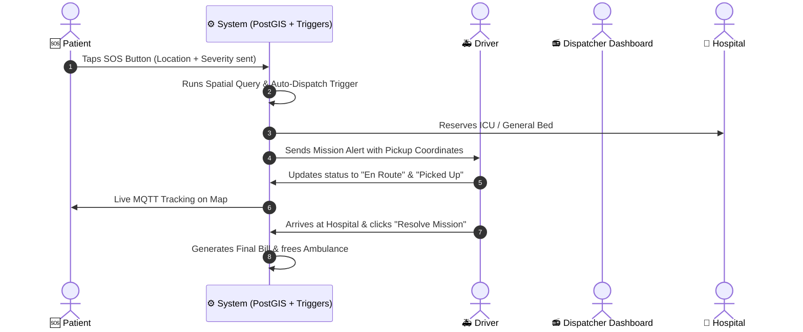

# 🚑 Druto Sheba (দ্রুত সেবা) - Project Concept, Architecture & Feature Guide

---

## 📌 ১. প্রজেক্টের মূল উদ্দেশ্য (Project Overview & Purpose)

**Druto Sheba (দ্রুত সেবা)** হলো একটি **Next-Generation Emergency Response & Fleet Management System** (জরুরি চিকিৎসা সেবা ও অ্যাম্বুলেন্স নেভিগেশন প্ল্যাটফর্ম)।

### 🎯 উদ্দেশ্য (Why it exists):
বাংলাদেশে জরুরি অবস্থায় রোগী, অ্যাম্বুলেন্স এবং হাসপাতালের মধ্যে সঠিক সমন্বয় না থাকায় অনেক সময় অপচয় হয়। এই প্রজেক্টের মূল লক্ষ্য হলো:
1. **জরুরি মুহূর্তে সাড়াদানের সময় (Dispatch Latency) কমানো**: রোগী ১-ট্যাপে SOS পাঠালে অটোমেটিক নিকটস্থ অ্যাম্বুলেন্স এবং সেরা হাসপাতাল খুঁজে বের করে।
2. **হাসপাতালের রিসোর্স সঠিক ব্যবহার (Resource Optimization)**: রোগীর রোগ অনুযায়ী (যেমন: হার্ট অ্যাটাক হলে কার্ডিওলজি স্পেশালিস্ট হাসপাতাল) এবং আইসিইউ/জেনারেল বেড খালী থাকা সাপেক্ষে অটো-অ্যাসাইন করে।
3. **লাইভ ট্র্যাকিং (Real-time GPS Telemetry)**: রোগী অ্যাপে লাইভ দেখতে পারে অ্যাম্বুলেন্স কোথায় আছে এবং কতক্ষণে পৌঁছাবে।

---

## 🔑 ২. প্রধান পোর্টাল এবং ফিচারসমূহ (Core Portals & Features)

### 1. 🆘 Patient Portal (`/sos` & `/track`) - রোগী মডিউল
* **One-Tap SOS Alert**: এক ক্লিকেই রোগীর বর্তমান জিও-লোকেশন (GPS Coordinates) এবং পূর্ব সংরক্ষিত মেডিকেল ইনফো (রক্তের গ্রুপ, অ্যালার্জি, জটিল রোগ) সহ ইমার্জেন্সি রিকোয়েস্ট সেন্ড হয়।
* **Live Map Tracking**: MQTT ও Leaflet.js দিয়ে বাস্তব সময়ে অ্যাম্বুলেন্সের লোকেশন ও গতি ট্র্যাক করা যায়।
* **Estimated Bill & Destination**: কোন হাসপাতালে নেওয়া হচ্ছে এবং আনুমানিক খরচ কত হবে তা লাইভ দেখা যায়।

### 2. 📻 Dispatcher Dashboard (`/dashboard`) - কমান্ড সেন্টার
* **Live Emergency Feed**: শহরের সমস্ত জায়গা থেকে আসা ইমার্জেন্সি রিকোয়েস্ট এক নজরে দেখা যায়।
* **Automated Dispatch Engine**: ডেটাবেসের স্টোরড প্রসিডিউর ও ট্র্রিগারের মাধ্যমে রোগীর কন্ডিশন ও দূরত্বের ওপর ভিত্তি করে অটোমেটিক অ্যাম্বুলেন্স ও হাসপাতাল সিলেক্ট করা হয়।
* **Manual Override**: ডিসপ্যাচার চাইলে ম্যানুয়ালি হাসপাতাল পরিবর্তন বা নির্দিষ্ট ড্রাইভারকে কল অ্যাসাইন করতে পারেন।

### 3. 🗺️ Driver App (`/duty`) - ড্রাইভার পোর্টাল
* **Mission Alert System**: নতুন ডিউটি আসার সাথে সাথে সংকেত এবং রোগীর ইমার্জেন্সি লেভেল (Low, Medium, High, Critical) দেখায়।
* **Status Synchronization**: ড্রাইভার একটি ক্লিকেই নিজের স্টেটাস আপডেট করতে পারে:
  `On Duty` ➔ `En Route` ➔ `Picked Up` ➔ `Arrived` ➔ `Resolved`.
* **Resource Auto-Release**: মিশন শেষ বা Resolve বাটন চাপলে অ্যাম্বুলেন্সটি আবার "Available" হয়ে যায় এবং হাসপাতালের বেড হিসাব আপডেট হয়।

### 4. 📊 Admin & Analytics (`/analytics` & `/fleet`) - অ্যাডমিন ও ফ্ল্যাট ম্যানেজমেন্ট
* **Hospital Resource Monitoring**: কোন হাসপাতালে কতগুলো সাধারণ বেড ও ICU বেড ফাকা আছে তার লাইভ ট্র্যাকিং।
* **Ambulance Maintenance**: প্রতি অ্যাম্বুলেন্স কতগুলো ট্রিপ মারলো, কবে সার্ভিসিং লাগবে (Predictive Maintenance) তা ট্র্যাক রাখা।
* **Financial & Billing Audit**: অটোমেটিক বিল তৈরি, পরিশোধের অবস্থা এবং সিস্টেমের রাজস্ব ট্র্যাকিং।

### 5. 👨‍⚕️ Doctor Assigning (`/doctors` & `/book-doctor`) - ডক্টর অ্যাসাইনিং
* **Specialized Doctor Mapping**: হাসপাতাল অনুযায়ী বিভিন্ন স্পেশালিটির চিকিৎসকদের শিডিউল ও অ্যাভেইল্যাবিলিটি ট্র্যাকিং।

---

## ⚙️ ৩. ব্যাকএন্ড ও ডেটাবেস সিস্টেম কীভাবে কাজ করে? (Backend & Database Architecture)

এই প্রজেক্টটিতে উচ্চ ক্ষমতার **PostgreSQL Database** এবং **PostGIS (Spatial Intelligence Extension)** ব্যবহার করা হয়েছে।

### 🗄️ ডেটাবেস টেবিল ও স্ট্রাকচার:
1. `emergency_requests`: সমস্ত ইমার্জেন্সি কল ও লোকেশন পয়েন্ট স্টোর করে।
2. `hospitals`: হাসপাতালের লোকেশন coordinates (`GEOMETRY Point`), সাধারণ বেড ও ICU বেড কাউন্ট সংরক্ষণ করে।
3. `ambulances` & `drivers`: গাড়ি ও ড্রাইভারদের অন-ডিউটি স্টেটাস পরিচালনা করে।
4. `trip_logs`: রোগী, হাসপাতাল, ড্রাইভার এবং অ্যাম্বুলেন্সের মধ্যে যুক্ত থাকা লাইভ মিশন রেকর্ড করে।
5. `billing`: ট্রিপ শেষ হলে অটোমেটিক ট্যাক্সসহ রাইড বিল ক্যালকুলেট করে।

### ⚡ অটোমেটেড ট্র্রিগার (Database Triggers):
* **`fn_automated_dispatch`**: যখনই নতুন রিকোয়েস্ট আসে, এই PL/pgSQL ফাংশনটি স্বয়ংক্রিয়ভাবে নিকটস্থ ফাকা অ্যাম্বুলেন্স এবং খালি বেড থাকা উপযুক্ত হাসপাতালটি বুক করে ট্রিপ চালু করে দেয়।
* **`emergency_analytics_mv`**: পারফরম্যান্স বাড়ানোর জন্য এটি একটি Materialized View যা লাইভ ড্যাশবোর্ডের সমস্ত হিসেব অতি দ্রুত রেন্ডার করে।

---

## 🔄 ৪. সম্পূর্ণ কাজের প্রবাহ (End-to-End Workflow Step-by-Step)

---

## 🛠️ ৫. ব্যবহৃত প্রযুক্তিসমূহ (Technology Stack Summary)

* **Frontend**: Next.js 16 (App Router), React 19, Tailwind CSS, Lucide Icons.
* **Database**: PostgreSQL with PostGIS extension.
* **Hosting / BaaS**: Supabase.
* **Real-time Map**: Leaflet.js with custom modern dark/light map themes.
* **Real-time Telemetry**: MQTT (HiveMQ) protocol.
