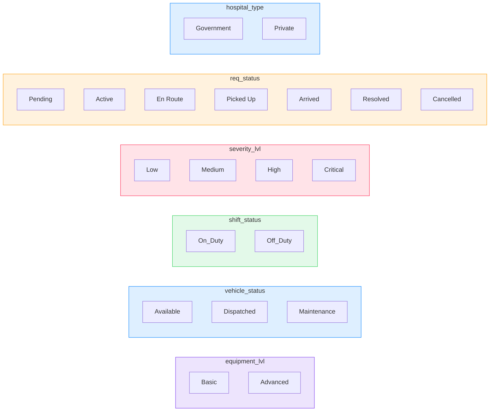
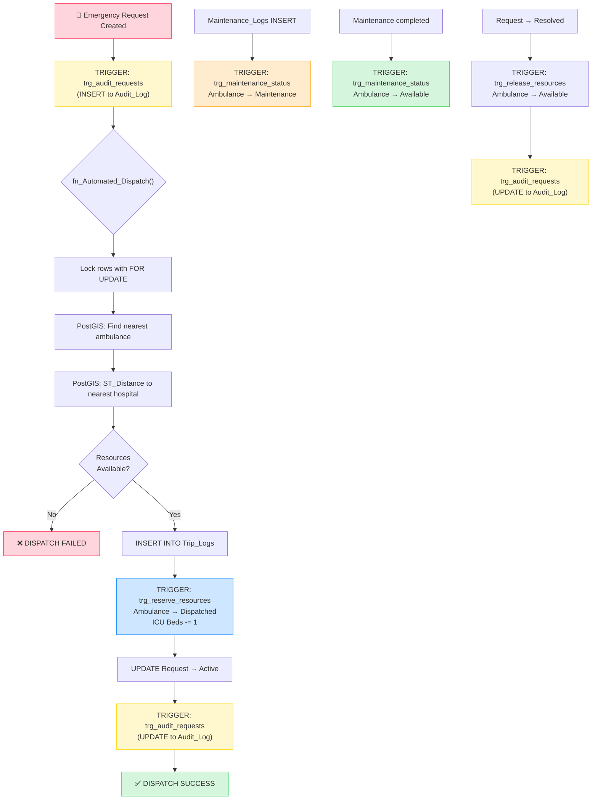

# Emergency Response System - Database Design (ER Diagram)

## Full ER Diagram (20 Tables)

```mermaid
erDiagram
    Patients {
        SERIAL Patient_ID PK
        VARCHAR Name "NOT NULL"
        VARCHAR Phone "NOT NULL"
        VARCHAR Blood_Type
    }

    Patient_Conditions {
        SERIAL Record_ID PK
        INT Patient_ID FK "NOT NULL"
        VARCHAR Condition_Name "NOT NULL"
    }

    Patient_Emergency_Contacts {
        SERIAL Contact_ID PK
        INT Patient_ID FK "NOT NULL"
        VARCHAR Contact_Name "NOT NULL"
        VARCHAR Relationship "NOT NULL"
        VARCHAR Phone "NOT NULL"
    }

    Hospitals {
        SERIAL Hospital_ID PK
        VARCHAR Name "NOT NULL"
        GEOMETRY Location_Coords "Point 4326"
        INT General_Beds "DEFAULT 0"
        INT ICU_Beds "DEFAULT 0"
        hospital_type Type "DEFAULT Private"
    }

    Specializations {
        SERIAL Spec_ID PK
        VARCHAR Spec_Name "UNIQUE NOT NULL"
        TEXT Description
    }

    Hospital_Specializations {
        INT Hospital_ID PK_FK
        INT Spec_ID PK_FK
        INT Specialist_Count "DEFAULT 0"
    }

    Ambulances {
        SERIAL Vehicle_ID PK
        VARCHAR License_Plate "UNIQUE NOT NULL"
        equipment_lvl Equipment_Level "NOT NULL"
        vehicle_status Current_Status "DEFAULT Available"
    }

    Vehicle_Inventory {
        SERIAL Inventory_ID PK
        INT Vehicle_ID FK "NOT NULL"
        VARCHAR Item_Name "NOT NULL"
        INT Quantity "CHECK >= 0"
        DATE Expiry_Date
        TIMESTAMP Last_Restocked
    }

    Maintenance_Logs {
        SERIAL Log_ID PK
        INT Vehicle_ID FK "NOT NULL"
        VARCHAR Maintenance_Type "NOT NULL"
        TEXT Description
        DECIMAL Cost "DEFAULT 0"
        DATE Date_Started "NOT NULL"
        DATE Date_Completed
        VARCHAR Technician_Name
    }

    Drivers {
        SERIAL Driver_ID PK
        VARCHAR Name "NOT NULL"
        VARCHAR License_No "UNIQUE NOT NULL"
        shift_status Shift_Status "DEFAULT Off_Duty"
    }

    Driver_Certifications {
        SERIAL Cert_ID PK
        INT Driver_ID FK "NOT NULL"
        VARCHAR Certification_Name "NOT NULL"
        VARCHAR Issuing_Authority "NOT NULL"
        DATE Date_Issued "NOT NULL"
        DATE Expiry_Date
        BOOLEAN Is_Active "DEFAULT TRUE"
    }

    Shift_Schedules {
        SERIAL Schedule_ID PK
        INT Driver_ID FK "NOT NULL"
        DATE Shift_Date "NOT NULL"
        TIME Start_Time "NOT NULL"
        TIME End_Time "NOT NULL"
        INT Zone_Assigned FK
    }

    Dispatch_Zones {
        SERIAL Zone_ID PK
        VARCHAR Zone_Name "UNIQUE NOT NULL"
        GEOMETRY Zone_Boundary "Polygon 4326"
        INT Priority_Level "CHECK 1-5"
    }

    Emergency_Types {
        SERIAL Type_ID PK
        VARCHAR Type_Name "UNIQUE NOT NULL"
        TEXT Description
        severity_lvl Default_Severity
        BOOLEAN Requires_Advanced_Equipment
    }

    Dispatchers {
        SERIAL Dispatcher_ID PK
        VARCHAR Name "NOT NULL"
        VARCHAR Shift_Time "NOT NULL"
    }

    Emergency_Requests {
        SERIAL Request_ID PK
        INT Patient_ID FK "NOT NULL"
        GEOMETRY Pickup_Coords "Point 4326"
        severity_lvl Severity_Level "NOT NULL"
        TIMESTAMP Timestamp_Created "DEFAULT NOW"
        req_status Status "DEFAULT Pending"
    }

    Trip_Logs {
        SERIAL Trip_ID PK
        INT Request_ID FK "UNIQUE NOT NULL"
        INT Vehicle_ID FK "NOT NULL"
        INT Driver_ID FK "NOT NULL"
        INT Hospital_ID FK "NOT NULL"
        INT Dispatcher_ID FK "NOT NULL"
        TIMESTAMP Time_Dispatched "DEFAULT NOW"
        TIMESTAMP Time_Arrived_Scene
        TIMESTAMP Time_Reached_Hospital
    }

    Billing {
        SERIAL Bill_ID PK
        INT Trip_ID FK "NOT NULL"
        INT Patient_ID FK "NOT NULL"
        DECIMAL Amount "NOT NULL"
        DECIMAL Tax "DEFAULT 0"
        DECIMAL Total_Amount "GENERATED"
        VARCHAR Payment_Status "CHECK constraint"
        DATE Date_Issued
        DATE Date_Paid
    }

    Trip_Feedback {
        SERIAL Feedback_ID PK
        INT Trip_ID FK "UNIQUE NOT NULL"
        INT Rating "CHECK 1-5"
        TEXT Comments
        INT Response_Time_Rating "CHECK 1-5"
        INT Driver_Rating "CHECK 1-5"
        TIMESTAMP Submitted_At
    }

    Audit_Log {
        SERIAL Audit_ID PK
        VARCHAR Table_Name "NOT NULL"
        VARCHAR Operation "CHECK constraint"
        INT Record_ID "NOT NULL"
        VARCHAR Changed_By "DEFAULT CURRENT_USER"
        TIMESTAMP Changed_At "DEFAULT NOW"
        JSONB Old_Values
        JSONB New_Values
    }

    %% === RELATIONSHIPS ===

    Patients ||--o{ Patient_Conditions : "has medical"
    Patients ||--o{ Patient_Emergency_Contacts : "has contacts"
    Patients ||--o{ Emergency_Requests : "raises"
    Patients ||--o{ Billing : "billed to"

    Hospitals ||--o{ Hospital_Specializations : "offers"
    Specializations ||--o{ Hospital_Specializations : "available at"
    Hospitals ||--o{ Trip_Logs : "destination"

    Ambulances ||--o{ Vehicle_Inventory : "carries"
    Ambulances ||--o{ Maintenance_Logs : "serviced in"
    Ambulances ||--o{ Trip_Logs : "dispatched as"

    Drivers ||--o{ Driver_Certifications : "holds"
    Drivers ||--o{ Shift_Schedules : "assigned to"
    Drivers ||--o{ Trip_Logs : "drives"

    Dispatch_Zones ||--o{ Shift_Schedules : "covers"

    Dispatchers ||--o{ Trip_Logs : "authorized by"

    Emergency_Requests ||--|| Trip_Logs : "fulfilled by"

    Trip_Logs ||--|| Billing : "generates"
    Trip_Logs ||--o| Trip_Feedback : "reviewed in"
```

---

## Relationship Matrix

| From | To | Cardinality | Constraint | Type |
|---|---|---|---|---|
| Patients | Patient_Conditions | 1:N | ON DELETE CASCADE | Identifying |
| Patients | Patient_Emergency_Contacts | 1:N | ON DELETE CASCADE | Identifying |
| Patients | Emergency_Requests | 1:N | FK Patient_ID | Non-identifying |
| Patients | Billing | 1:N | FK Patient_ID | Non-identifying |
| Hospitals | Hospital_Specializations | M:N | Composite PK | Associative |
| Specializations | Hospital_Specializations | M:N | Composite PK | Associative |
| Hospitals | Trip_Logs | 1:N | FK Hospital_ID | Non-identifying |
| Ambulances | Vehicle_Inventory | 1:N | ON DELETE CASCADE | Identifying |
| Ambulances | Maintenance_Logs | 1:N | ON DELETE CASCADE | Identifying |
| Ambulances | Trip_Logs | 1:N | ON DELETE CASCADE | Non-identifying |
| Drivers | Driver_Certifications | 1:N | ON DELETE CASCADE | Identifying |
| Drivers | Shift_Schedules | 1:N | ON DELETE CASCADE | Identifying |
| Drivers | Trip_Logs | 1:N | ON DELETE CASCADE | Non-identifying |
| Dispatch_Zones | Shift_Schedules | 1:N | FK Zone_ID | Non-identifying |
| Dispatchers | Trip_Logs | 1:N | FK Dispatcher_ID | Non-identifying |
| Emergency_Requests | Trip_Logs | 1:1 | UNIQUE FK | Identifying |
| Trip_Logs | Billing | 1:1 | FK Trip_ID | Non-identifying |
| Trip_Logs | Trip_Feedback | 1:0..1 | UNIQUE FK | Non-identifying |

---

## Enum Types

---

## Trigger Chain Flow

---

## Schema Statistics

| Metric | Count |
|---|---|
| **Tables** | 20 |
| **Custom Enum Types** | 6 |
| **Views** | 3 (Active_Dashboard_View, Low_Inventory_Alert, geometry/geography_columns) |
| **Triggers** | 5 |
| **Stored Functions** | 5 |
| **Indexes** | 12 (5 B-Tree + 3 GiST Spatial + 4 composite) |
| **Foreign Keys** | 22 |
| **CHECK Constraints** | 6 |
| **UNIQUE Constraints** | 8 |
| **GENERATED Columns** | 1 (Billing.Total_Amount) |
| **PostGIS Geometries** | 3 types (Point, Polygon across 3 tables) |
| **JSONB Columns** | 2 (Audit_Log.Old_Values, New_Values) |
