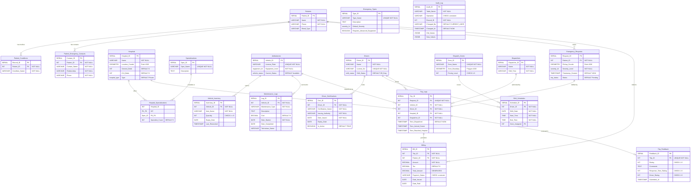

```mermaid
erDiagram
    Patients {
        SERIAL Patient_ID PK
        VARCHAR Name "NOT NULL"
        VARCHAR Phone "NOT NULL"
        VARCHAR Blood_Type
    }

    Patient_Conditions {
        SERIAL Record_ID PK
        INT Patient_ID FK "NOT NULL"
        VARCHAR Condition_Name "NOT NULL"
    }

    Patient_Emergency_Contacts {
        SERIAL Contact_ID PK
        INT Patient_ID FK "NOT NULL"
        VARCHAR Contact_Name "NOT NULL"
        VARCHAR Relationship "NOT NULL"
        VARCHAR Phone "NOT NULL"
    }

    Hospitals {
        SERIAL Hospital_ID PK
        VARCHAR Name "NOT NULL"
        GEOMETRY Location_Coords "Point 4326"
        INT General_Beds "DEFAULT 0"
        INT ICU_Beds "DEFAULT 0"
        hospital_type Type "DEFAULT Private"
    }

    Specializations {
        SERIAL Spec_ID PK
        VARCHAR Spec_Name "UNIQUE NOT NULL"
        TEXT Description
    }

    Hospital_Specializations {
        INT Hospital_ID PK_FK
        INT Spec_ID PK_FK
        INT Specialist_Count "DEFAULT 0"
    }

    Ambulances {
        SERIAL Vehicle_ID PK
        VARCHAR License_Plate "UNIQUE NOT NULL"
        equipment_lvl Equipment_Level "NOT NULL"
        vehicle_status Current_Status "DEFAULT Available"
    }

    Vehicle_Inventory {
        SERIAL Inventory_ID PK
        INT Vehicle_ID FK "NOT NULL"
        VARCHAR Item_Name "NOT NULL"
        INT Quantity "CHECK >= 0"
        DATE Expiry_Date
        TIMESTAMP Last_Restocked
    }

    Maintenance_Logs {
        SERIAL Log_ID PK
        INT Vehicle_ID FK "NOT NULL"
        VARCHAR Maintenance_Type "NOT NULL"
        TEXT Description
        DECIMAL Cost "DEFAULT 0"
        DATE Date_Started "NOT NULL"
        DATE Date_Completed
        VARCHAR Technician_Name
    }

    Drivers {
        SERIAL Driver_ID PK
        VARCHAR Name "NOT NULL"
        VARCHAR License_No "UNIQUE NOT NULL"
        shift_status Shift_Status "DEFAULT Off_Duty"
    }

    Driver_Certifications {
        SERIAL Cert_ID PK
        INT Driver_ID FK "NOT NULL"
        VARCHAR Certification_Name "NOT NULL"
        VARCHAR Issuing_Authority "NOT NULL"
        DATE Date_Issued "NOT NULL"
        DATE Expiry_Date
        BOOLEAN Is_Active "DEFAULT TRUE"
    }

    Shift_Schedules {
        SERIAL Schedule_ID PK
        INT Driver_ID FK "NOT NULL"
        DATE Shift_Date "NOT NULL"
        TIME Start_Time "NOT NULL"
        TIME End_Time "NOT NULL"
        INT Zone_Assigned FK
    }

    Dispatch_Zones {
        SERIAL Zone_ID PK
        VARCHAR Zone_Name "UNIQUE NOT NULL"
        GEOMETRY Zone_Boundary "Polygon 4326"
        INT Priority_Level "CHECK 1-5"
    }

    Emergency_Types {
        SERIAL Type_ID PK
        VARCHAR Type_Name "UNIQUE NOT NULL"
        TEXT Description
        severity_lvl Default_Severity
        BOOLEAN Requires_Advanced_Equipment
    }

    Dispatchers {
        SERIAL Dispatcher_ID PK
        VARCHAR Name "NOT NULL"
        VARCHAR Shift_Time "NOT NULL"
    }

    Emergency_Requests {
        SERIAL Request_ID PK
        INT Patient_ID FK "NOT NULL"
        GEOMETRY Pickup_Coords "Point 4326"
        severity_lvl Severity_Level "NOT NULL"
        TIMESTAMP Timestamp_Created "DEFAULT NOW"
        req_status Status "DEFAULT Pending"
    }

    Trip_Logs {
        SERIAL Trip_ID PK
        INT Request_ID FK "UNIQUE NOT NULL"
        INT Vehicle_ID FK "NOT NULL"
        INT Driver_ID FK "NOT NULL"
        INT Hospital_ID FK "NOT NULL"
        INT Dispatcher_ID FK "NOT NULL"
        TIMESTAMP Time_Dispatched "DEFAULT NOW"
        TIMESTAMP Time_Arrived_Scene
        TIMESTAMP Time_Reached_Hospital
    }

    Billing {
        SERIAL Bill_ID PK
        INT Trip_ID FK "NOT NULL"
        INT Patient_ID FK "NOT NULL"
        DECIMAL Amount "NOT NULL"
        DECIMAL Tax "DEFAULT 0"
        DECIMAL Total_Amount "GENERATED"
        VARCHAR Payment_Status "CHECK constraint"
        DATE Date_Issued
        DATE Date_Paid
    }

    Trip_Feedback {
        SERIAL Feedback_ID PK
        INT Trip_ID FK "UNIQUE NOT NULL"
        INT Rating "CHECK 1-5"
        TEXT Comments
        INT Response_Time_Rating "CHECK 1-5"
        INT Driver_Rating "CHECK 1-5"
        TIMESTAMP Submitted_At
    }

    Audit_Log {
        SERIAL Audit_ID PK
        VARCHAR Table_Name "NOT NULL"
        VARCHAR Operation "CHECK constraint"
        INT Record_ID "NOT NULL"
        VARCHAR Changed_By "DEFAULT CURRENT_USER"
        TIMESTAMP Changed_At "DEFAULT NOW"
        JSONB Old_Values
        JSONB New_Values
    }

    %% === RELATIONSHIPS ===

    Patients ||--o{ Patient_Conditions : "has medical"
    Patients ||--o{ Patient_Emergency_Contacts : "has contacts"
    Patients ||--o{ Emergency_Requests : "raises"
    Patients ||--o{ Billing : "billed to"

    Hospitals ||--o{ Hospital_Specializations : "offers"
    Specializations ||--o{ Hospital_Specializations : "available at"
    Hospitals ||--o{ Trip_Logs : "destination"

    Ambulances ||--o{ Vehicle_Inventory : "carries"
    Ambulances ||--o{ Maintenance_Logs : "serviced in"
    Ambulances ||--o{ Trip_Logs : "dispatched as"

    Drivers ||--o{ Driver_Certifications : "holds"
    Drivers ||--o{ Shift_Schedules : "assigned to"
    Drivers ||--o{ Trip_Logs : "drives"

    Dispatch_Zones ||--o{ Shift_Schedules : "covers"

    Dispatchers ||--o{ Trip_Logs : "authorized by"

    Emergency_Requests ||--|| Trip_Logs : "fulfilled by"

    Trip_Logs ||--|| Billing : "generates"
    Trip_Logs ||--o| Trip_Feedback : "reviewed in"
```
